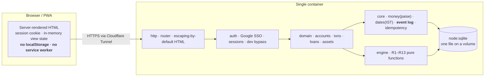
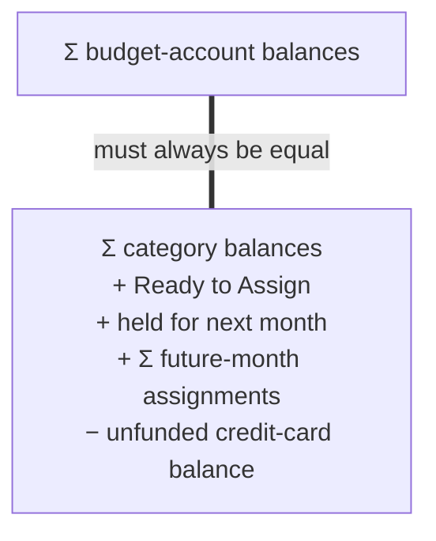
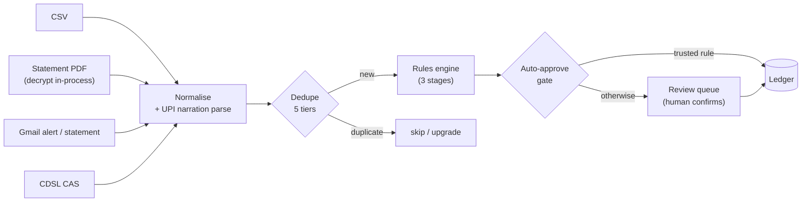
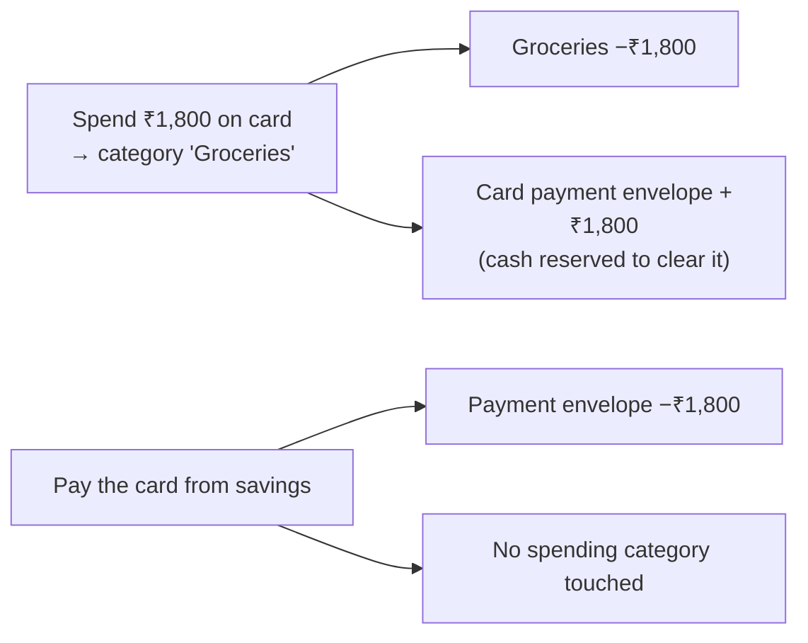
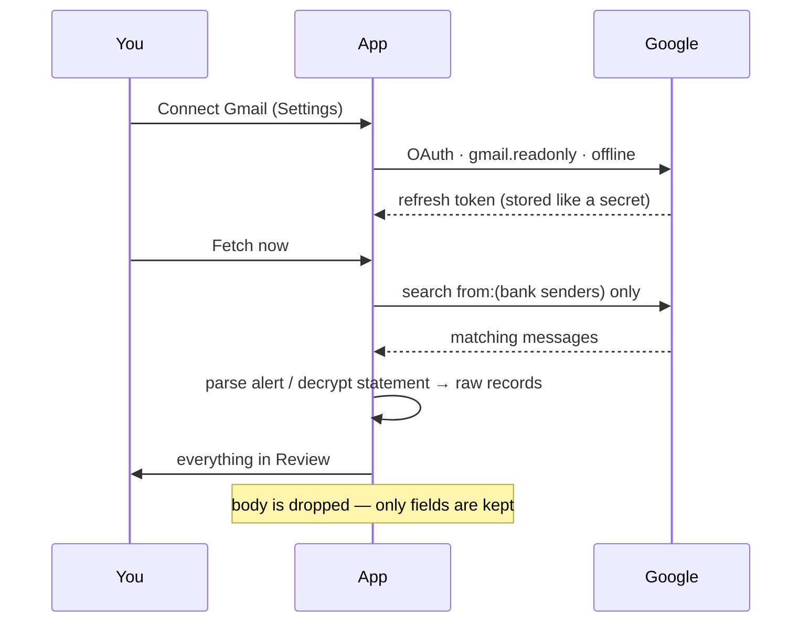
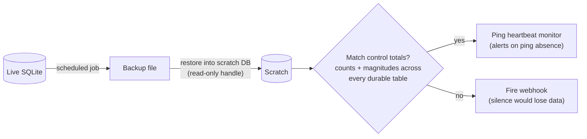
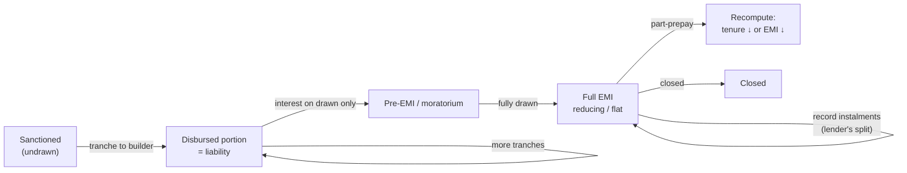

# Pathayam

A strict **envelope (zero-based) budgeting app** for one Indian household —
self-hosted, server-rendered, installable as a PWA, with the ingestion and
loan/asset machinery Indian banking actually needs.

*Pathayam* (പത്തായം) is the tall wooden chest that stood in a Kerala house and
held the year's harvest: you filled it once and drew from it deliberately, and
what you took out in March was decided by what you put in at harvest. That is
the whole idea here — money already earned, given a job before it is spent.

Every rupee gets a job before it is spent. The engine is YNAB-grade (rollover,
overspend handling, credit-card payment envelopes); the ingestion layer is built
for UPI noise, split credit-card cycles and password-protected statement PDFs;
and it runs as a single container with **zero runtime dependencies**.

The full functional design lives in [`docs/`](docs/00-README.md). This file is
how you run it and what it does. There is also a [website](website/) — home, features, pricing, an interactive
envelope demo, 34 how-to guides and an API reference — published from `website/`
by
[a Pages workflow](.github/workflows/pages.yml). Its waitlist form posts to a
Google Sheet via [`website/waitlist.gs`](website/waitlist.gs); set the endpoint
in `website/site.js` to switch it on.

```
Status   P0 → P6 complete   950 tests   0 deps
Stack    TypeScript on Node 24+   node:sqlite   node:http   server-rendered HTML
Deploy   Docker Compose · homelab behind Cloudflare Tunnel · SQLite on a volume
```


<sub>The purple banner appears only when the development auth-bypass is on; it is absent in production.</sub>

---

## Contents

- [What it is](#what-it-is)
- [Quick start (5 minutes)](#quick-start-5-minutes) — including [demo data](#demo-data)
- [Feature tour](#feature-tour)
- [How the core flows work](#how-the-core-flows-work) — diagrams
- [Screens](#screens)
- [Production deployment](#production-deployment) — step by step
- [Configuration reference](#configuration-reference)
- [Backups & recovery](#backups--recovery)
- [Updating](#updating)
- [Architecture](#architecture)
- [What isn't built](#what-isnt-built)

---

## What it is

- **A budget engine, not a tracker.** Money is assigned to categories
  ("envelopes") until nothing is left unassigned. Overspending is handled
  explicitly — you cover it from another envelope, or it reduces next month.
  Both overspend models (YNAB's and Actual's) ship; neither is a stub.
- **Credit cards done right.** Spending on a card creates a payment envelope
  holding the cash to clear it, so a card balance can never be an unfunded
  surprise. Add-on cards (one member's card on another's account) are modelled
  as a first-class mechanic.
- **India-native ingestion.** CSV and password-protected statement PDFs from 11
  banks, UPI narration parsing, five-tier duplicate detection, a review queue,
  a learning rules engine, the CDSL CAS for holdings, and optional read-only
  Gmail fetching of alerts and statements.
- **Loans and investments, contained.** A full amortisation engine (four
  interest models, tranches, pre-EMI, moratorium, prepayment). Unit-based
  holdings with FIFO lots, XIRR, and a net-worth statement — behind a firewall
  (R30) so a portfolio doubling can never touch your budget.
- **Pooled or separate, your choice.** Most households pool everything, and that
  is the default and needs no configuring. For the ones that would rather keep
  their own accounts and split the shared bills, each member can open a budget of
  their own and commit an agreed amount to the household — without a rupee moving
  between accounts, and without publishing what it came out of. Both sets of books
  close independently, and the app's word for a lopsided month is *ahead*, not
  *debt*.
- **Server-only and auditable.** No client storage, no service worker. Every
  mutation is an append-only event, giving universal undo, "explain this
  number", and as-of-date views from one mechanism. Verified backup restore is
  a shipping requirement, not an afterthought.

---

## Quick start (5 minutes)

Everything runs through Docker Compose. **Node is not needed on the host.**

```bash
git clone <this-repo> budget && cd budget
cp .env.example .env

# Seed a demo household (two members, four accounts, a month of real behaviour)
docker compose --profile seed up seed

# Start the dev server with the auth bypass on
docker compose --profile dev up
```

Open <http://localhost:8080> and sign in as **Ravi** or **Priya**. The source is
mounted and Node watches it, so an edit restarts the server without a rebuild.

The seed deliberately includes a cash overspend, a credit overspend and a card
payment, so the screens show real behaviour rather than an empty grid.

### Demo data

Every household, member, account, card, balance and transaction in this
repository is fictional — in the seed, in the test fixtures, in the screenshots
and in the worked examples throughout `docs/`. The sample bank statements under
`src/import/statements.test-data.ts` are PDFs generated with reportlab against
each bank's published layout, not anybody's statements; the one encrypted
fixture is locked with a password derived from the fictional identity so the
tests can exercise the whole decrypt-and-parse chain.

That is a design constraint rather than a tidy-up. Real statements are
password-protected behind a PAN or a date of birth, and neither those nor the
files they open have any business in a repository. The institution list in
`09-decisions-log.md` is likewise a composite — it is there to justify why the
parser matrix has the shape it does, not to describe anyone's finances.

> The dev profile sets `DEV_LOGIN`, which **bypasses authentication completely**.
> It exists only in the `dev` Docker stage, is absent from the production image
> (R38.5), and the app refuses to start if it is set alongside anything
> production-shaped — `NODE_ENV=production`, a public hostname, or real Google
> credentials (R38.3). A LAN address still counts as development.

**Run the tests and typecheck:**

```bash
docker compose --profile test up test
```

The engine tests encode the worked ₹ examples from the design docs and assert
the accounting identity after every scenario — if a change breaks that identity,
the change is wrong.

Prefer bare Node? `npm install && npm test`, then `DEV_LOGIN=true npm run dev`.
Compose is the supported path and the only one the production image is built
from.

---

## Feature tour

### The budget engine (`02` R1–R13)

| Feature | What it does |
|---|---|
| **Zero-based assignment** | Assign every rupee to a category until Ready to Assign is 0. |
| **Rollover** | Each month a category carries its leftover (or its overspend) forward. |
| **Two overspend models** | *Reduce next month's RTA* (Actual's, default) or *carry a negative category balance* (YNAB's). Switchable; a full-history recompute follows. |
| **Cover overspend** | One-tap move from another envelope, with ranked source suggestions. |
| **Credit-card payment envelopes** | Card spending reserves the cash to clear it; the envelope tracks the debt, symmetric with a loan's. |
| **Add-on cards** | A member's card on another's account; the transaction owner defaults to the cardholder (R6.e). |
| **Card purchase → EMI** | Convert a charge to an instalment plan from the transaction itself. The card's outstanding falls so the same purchase is never funded twice; the fee and its GST are charged to the card and need an envelope; the plan gets its own schedule and payment envelope. The plan can be named after what you bought, and whatever the card's payment envelope was holding against the charge moves across to it — the money set aside to clear the purchase is the money that now pays its instalments. |
| **Statement cycles** | A card's statement day tags every charge with the cycle it bills in — a cycle runs from the day after one statement to the next, so a charge on the 19th with a statement day of 18 bills next month. It clamps in a short month, and the cycles tile the calendar with no gaps. |
| **Cards at a glance** | With several cards on different cycles, the daily question is *which one is due next and for how much*. One screen answers it, due date first, and a shortfall is never reported larger than the card actually owes. |
| **Targets & auto-assign** | Per-category targets, and one-tap fund-to-target with a preview before it commits. Ready to Assign is spent down the budget in order, so what you budgeted for is funded first. |
| **Reorder** | ↑/↓ on every category and group, so the grid reads in the order the household thinks in rather than the order things were created. Each move is one undoable step. |
| **App-managed envelopes** | Card payment envelopes and one envelope per goal are created, named and retired by the app. They carry no manual controls, and are marked *managed by the app* so it is obvious why. |
| **Hold for next month / Buffer** | Park income for next month; a one-month buffer is a first-class state. When more than two months of typical spending is sitting unassigned — the shape of an income that arrives in lumps rather than monthly — the digest says so and offers a month. |
| **Forward recompute (R7.g)** | Editing any past month re-derives every month since, under the active overspend model, as one undoable batch. |
| **Explain this number** | Ready to Assign and every category balance drill into the events that produced them. |
| **Groups you can tidy** | Rename a group in place, reorder it, delete it once it is empty — refusing while it holds envelopes, because deleting those with it would lose balances at a click. App-managed groups say so and are left alone. |

### Money kept separately (`15`)

For a household that would rather not pool everything. A household that does
pool everything never sees any of this — there is no second grid, no extra
column, and no control for a distinction it has not made.

| Feature | What it does |
|---|---|
| **A budget of your own** | Open one when you want it. Your accounts move into it, it keeps its own envelopes and its own Ready to Assign, and nobody else can see it — not through *view as*, not through an aggregate. |
| **Private accounts and cards** | Genuinely private, and only where that is honest: in your own budget, where the household's Ready to Assign never sums it. The household budget still refuses, because a total built on a balance publishes it by subtraction. |
| **Committing without moving money** | One envelope in your budget is the household's. Assigning to it commits that money and moves not a rupee — so a private account can fund shared spending without publishing its balance. Set a standing monthly figure once instead of remembering it. |
| **Paying for shared things from your own account** | File it to a household envelope. The household's envelope falls, your commitment falls, no transfer happens. Shared cards, add-on cards and split receipts all follow the same one rule. |
| **Ahead and behind** | Not *debt*, not *owes*. If you have paid for more of the household than you put aside, you are ahead, and it carries forward until one of you settles it. |
| **Three ways to end a month** | *Put it down to me* (your share was larger), *I'll pick it up* (the other commits it), or *call it even* — the only one that lets something go, and it lands as spending on the giving side because the money still has to come from somewhere. |
| **The household page** | What each of you put in this month, what was spent, and where it stands. Nothing else — no balances, no accounts, no other envelopes. |
| **Independent month close** | The household's month can close while a personal one is still open. The household's close reports what each member put in. |
| **Leaving** | Removing a member deletes nothing — their name stays on everything they entered, and adding the address back restores them. If a balance is outstanding the app offers the endings and picks none: give it back, record it as family lending, or call it even. |
| **Whose money, as a filter** | Reports and Query ask rather than assume. A transaction that crosses budgets counts under both ends, because which one you mean depends on the question. |

### Money in — ingestion (`04`)

| Feature | What it does |
|---|---|
| **Manual entry** | Amount expressions (`450+120`), splits, transfers, tags, owner, cleared flag, memo. |
| **CSV import** | Header detection, Indian amount formats, UPI narration extraction, saved per-bank column mappings. |
| **Statement PDFs** | 11 banks (HDFC, ICICI, Axis, SBI, Union, Canara, YES, IndusInd, Kotak, RBL, HSBC) plus broker contract notes. Password-protected files opened in-process — no external tool, no library. |
| **Password derivation** | Optionally work out the statement password from your saved name / DOB / PAN / mobile / card last-4, so nobody types one. Opt-in, never exported, never logged. |
| **Reconciliation check** | Every parse is verified against the statement's own closing balance. On a real 848-row Axis statement it reconciles to the paisa. |
| **CDSL CAS import** | The monthly consolidated statement is the primary way holdings get in; rows reconcile against existing lots rather than duplicating. |
| **Five dedupe tiers** | Exact, strong (reference), probable, weak, and manual-vs-imported — no receipt appears twice from SMS + email + statement. |
| **Review queue** | Nothing auto-posts; everything imported waits for a human, with raw rows shown throughout. |
| **Learning rules** | Categorise a payee twice → a rule is proposed (never auto-applied); every proposal states the inference it came from. Filing counts wherever it happens — from the transaction screen as much as from an import — so the app learns from how you actually work. Confirmed rules apply to history with a preview. |
| **Gmail ingestion** | Opt-in, read-only, offline. Reads only the banks' own addresses: an alert becomes a review row within seconds; a statement PDF is fetched, decrypted and parsed on arrival. Add-on alerts route to the right account. |
| **Receipt attachments** | A photo or PDF per transaction, stored server-side in the database, served `no-store` so no device caches it (Q10, R35). |

### Understanding your money

| Feature | What it does |
|---|---|
| **Reports** | Income vs. spending, spending by category over time, loan interest by financial year. |
| **Query** | One filterable, groupable transaction table everything else drills into; CSV export. Totals sum every matching row — the page you see is a page, and says so. |
| **Search** | Across cleaned *and* raw imported strings. |
| **Schedules & cashflow calendar** | Recurring transactions and money coming in (with detection), editable and deletable, and a forward balance projection — "will I make it to the 30th?". Marking one *paid* or *arrived* posts the transaction and rolls the schedule; *skip* rolls it without posting. Every outgoing schedule names an envelope, because a promise about money leaving with nothing behind it is what zero-based budgeting exists to prevent. |
| **Goals** | Long-horizon savings kept off the monthly grid. |
| **Month close** | A once-a-month ritual: what the month did, R29.4's four-way net-worth change, a dated snapshot, and whether next month is funded. Locks nothing. |
| **In-app digest** | Per-member notifications (unfunded card, subscription renewing, overspend, month ready to close, things waiting in Review, cashflow dip, a spare month unassigned) — in-app only, nothing to draw you back. Each kind is individually mutable. |

### Debt — loans (`06`)

| Feature | What it does |
|---|---|
| **Amortisation engine** | Four interest models: reducing balance, flat (with the equivalent reducing rate shown), moratorium-serviced, moratorium-capitalised. |
| **Tranche drawdown** | Record disbursements as you draw; a builder payment raises the liability without touching your budget, a bank credit arrives to assign (R15). |
| **Pre-EMI / moratorium** | Interest-only obligation on the drawn amount, and both moratorium models with the capitalisation cost quantified before you choose it. |
| **Instalments & drift** | Record each instalment with the lender's split; drift is measured against a lender statement, never against your own ledger. Paying from a credit account posts a categorised charge rather than a transfer, because a card EMI bills on the card. |
| **The EMI is budgeted by default** | A loan's payment envelope gets a monthly target equal to its EMI from the moment the loan exists, and a rate change or a new disbursement moves the target with it. |
| **Closing and foreclosure** | A loan that reaches zero says so and offers to close. Settling early records the foreclosure charge against a real account and an envelope, so the prepayment decision is taken against the saving actually on offer. |
| **Whose loan it is** | A loan belongs to a budget, and a private one is visible only to its holder — on the list, in *Everything you owe*, and in net worth. The owner is shown on the list, not only in the detail page. |
| **Prepayment calculator** | Tenure-reduction vs. EMI-reduction, the saving shown side by side before you commit — and the column you pick is the one that happens: reducing the tenure holds the instalment and shortens the loan, reducing the EMI keeps the closure date. The lump sum leaves the envelope you name. |
| **Rate resets** | Both options the lender must offer, priced against your actual balance at the rate you type — keep the instalment and move the tenure, or keep the tenure and move the instalment. Whichever you take is applied, and the loan's envelope is re-targeted to match. |
| **Family lending** | Money lent to / borrowed from people, with no interest engine (they don't have one). Balance derived from what moved; write-off available. |

### Assets & net worth (`07`)

| Feature | What it does |
|---|---|
| **Unit holdings** | Stored as units with FIFO lots — enables cost basis, realised/unrealised split, and XIRR as the headline return. |
| **Price feeds** | MFAPI (mutual funds), AMFI (fallback, matched on ISIN), Frankfurter (FX), Alpha Vantage (optional equities). Per-class refresh cadence. |
| **Net worth** | R29.4's four-way decomposition (money saved / market / FX / debt repaid), with a dated history. |
| **Allocation** | By class, geography and currency; an unclassified fund is shown as such, never guessed into a bucket (N9). |
| **CSV export** | Holdings, lots, price history and the net-worth series (F19.13). |
| **The R30 firewall** | Ten invariants as a test suite — including one that drops the price tables and renders the budget screen, proving the budget never reads them. |

### Platform & operations (`08`)

| Feature | What it does |
|---|---|
| **Google SSO** | Closed allow-list, enforced on every request. First sign-in on a fresh instance becomes a member; everyone else is invited. |
| **Sessions & impersonation** | Per-device revocation; read-only *view as* another member, always logged — and off entirely unless `ADMIN_DEBUG` is set, because a personal budget somebody else can step into is not a separate budget (R38.6a). |
| **Personal API tokens** | Scoped read / read-write, shown once and stored as a hash, rate-limited separately, structurally unable to sign in or mint more tokens. |
| **Feature flags** | Loans, assets and multi-currency each disableable per deployment; a disabled module vanishes from nav, palette and reports (F28). |
| **Backup & verified restore** | The scheduled job restores the latest backup into a scratch DB and matches control totals; failure fires a webhook, success pings a dead-man's-switch. |
| **Health page** | The page you open at 2am — backup status, price-feed health, flags, error counts. |
| **Command palette** | `Cmd/Ctrl-K` from anywhere; complete and flag-aware. |
| **Realised gains by FY** | Every sale keeps the parcels it consumed, so gains split by holding period, April to March. It reports the holding period and names no tax class — which threshold applies depends on the asset and the year's rules, and that judgement stays with whoever files. |
| **Money you're owed** | Mark a transaction reimbursable; Review lists what is outstanding until it comes back. |
| **Universal undo** | Every action undoes within 30 days, from the event log, on [Activity](#screens). An undo is recorded as its own entry — nothing is edited or deleted. Where later edits touched the same record, it shows what it would discard before it does it, and it refuses outright when the record is load-bearing for a loan instalment, a portfolio lot or a reconciliation. |

---

## How the core flows work

GitHub renders these diagrams inline.

### Architecture — server-only by policy (R35)



### The envelope engine identity (`docs/dev/01-engine-derivation.md`)

Every computed month must satisfy one equation, asserted in tests after every
scenario:



### Import → review → ledger (`04` §1)

Every source — CSV, PDF, CAS, Gmail alert — produces the **same raw record** and
lands in the **same review queue**. Nothing auto-posts.



### The credit-card payment envelope (`02` R6)

Why a card balance is never an unfunded surprise:



### Gmail ingestion — a separate, opt-in grant (`04` §3.4)



### Backup → verified restore (R40.2) — a shipping requirement



### Loan lifecycle (`06` R15/R16)



---

## Screens

The app is server-rendered HTML — every screen is a plain URL you can open. This
table is the map; run the [quick start](#quick-start-5-minutes) to see them live
with the demo data.

| Screen | Route | What you see |
|---|---|---|
| **Budget** | `/` | The month grid: groups, categories, assigned/activity/available, Ready to Assign, the in-app digest. |
| **Accounts** | `/accounts` | Every account with cleared/uncleared/working balances; each opens a register. |
| **Cards** | `/cards` | Every credit card in the order it falls due: what is owed, what is set aside, what has nothing behind it, and the statement and due date when one has been recorded. |
| **Register** | `/accounts/:id` | A running-balance transaction list for one account, with reconcile. |
| **Transaction** | `/transaction/:id` | Edit, splits, tags, owner; raw imported values; full event history; **receipts**. |
| **Add** | `/add` | One form for money in, money out and transfers. An expense must name its envelope. |
| **Move money** | `/move` | Move between envelopes, with a note explaining that this never changes Ready to Assign. |
| **Hold** | `/hold` | Keep part of this month’s Ready to Assign for next month — how you get to spending last month’s income. |
| **Review** | `/review` | Everything awaiting a decision: imports, suspected duplicates, uncategorised (filed inline), overspent, unfunded cards, proposed rules, and money you're owed. |
| **Import** | `/import` | CSV paste / statement-PDF upload with password hints; saved mappings. |
| **Reports** | `/reports` | Income vs. spend, category trends, loan interest by FY, realised gains by FY split by holding period. |
| **Overview** | `/overview` | Runway, due-soon bills, the month at a glance. |
| **Query** | `/query` | The filterable, groupable table; CSV export. Totals are summed over every matching row, not the page you can see. |
| **Search** | `/search` | Everything, from one box — reachable with `/` from any screen. |
| **Schedules** | `/schedules` | Recurring items and the forward cashflow calendar. |
| **Goals** | `/goals` | Long-horizon savings with progress rings. |
| **Loans** | `/loans`, `/loans/:id` | Each loan's real cost, schedule, drift, prepayment calculator, disbursements. |
| **Family lending** | `/family` | Lent / borrowed, derived balances, write-off. |
| **Portfolio** | `/portfolio` | Holdings as units, XIRR, allocation, CAS import, CSV export. |
| **Valuations** | `/portfolio/valuations` | Every hand-valued pot — gold, retirement, anything outside CAS — updated in one sitting, each showing what it was last worth and when. |
| **Net worth** | `/net-worth` | The four-way decomposition and dated history. |
| **Month close** | `/months` | The monthly ritual and closed-month history. |
| **Payees** | `/payees` | Every payee, what it is usually filed as, and merge. |
| **Rules** | `/rules` | Automatic categorisation: what fires, what the app has proposed from your own filing, and a tester. |
| **Categories** | `/categories` | Rename, set targets, reorder with ↑/↓, hide, delete. Payment and goal envelopes are marked *managed by the app*. |
| **Activity** | `/activity` | Every change ever made, and the undo for it. Where later edits touched the same record, the undo shows what it would discard first. |
| **Settings** | `/settings` | Household, theme, devices, Gmail connection, statement identity, notification prefs, API tokens. |
| **Health** | `/health` | Backup status, restore verification, price feeds, feature flags, error counts. |
| **Terms / Privacy** | `/terms`, `/privacy` | Public, signed out — Google's consent screen requires both before it grants `gmail.readonly`. |

### A look at the screens

Captured from a running instance with the demo household. The UI is theme-aware
(light / dark / system); these are the dark theme.

| Portfolio | Net worth |
|---|---|
| [](docs/screenshots/portfolio.png) | [](docs/screenshots/net-worth.png) |
| **Allocation** | **Loans** |
| [](docs/screenshots/allocation.png) | [](docs/screenshots/loans.png) |

| One loan | A rate reset |
|---|---|
| [](docs/screenshots/loan.png) | [](docs/screenshots/loan-rate.png) |

| What a prepayment buys | A charge becoming an EMI |
|---|---|
| [](docs/screenshots/loan-prepay.png) | [](docs/screenshots/convert-to-emi.png) |
| **Accounts** | **Review queue** |
| [](docs/screenshots/accounts.png) | [](docs/screenshots/review.png) |
| **Import** | **Schedules** |
| [](docs/screenshots/import.png) | [](docs/screenshots/schedules.png) |
| **Goals** | **Reports** |
| [](docs/screenshots/goals.png) | [](docs/screenshots/reports.png) |
| **Health** | **Settings** |
| [](docs/screenshots/health.png) | [](docs/screenshots/settings.png) |
| **Categories** | **Overview** |
| [](docs/screenshots/categories.png) | [](docs/screenshots/overview.png) |
| **Activity** | **Cards** |
| [](docs/screenshots/activity.png) | [](docs/screenshots/cards.png) |
| **Query** | **Valuations** |
| [](docs/screenshots/query.png) | [](docs/screenshots/valuations.png) |

Click any image for the full-resolution capture. Every figure, name and account
number in them comes from `npm run seed` — a fictional household. No real
financial data appears anywhere in this repository; see
[Demo data](#demo-data).

To regenerate them after a UI change, seed a demo household, start the dev
server with the bypass on, and run the capture script:

```bash
node docs/dev/capture-screenshots.mjs --port 8080
```

It drives headless Chromium over the DevTools protocol — no driver library, so
B1's zero-dependency rule holds for the tooling too. It signs in through
`POST /auth/dev`, which only exists when `DEV_LOGIN` is set, and it strips the
development banner so the images document the app rather than this machine.

### Charts

Every chart is server-rendered inline SVG — no client-side charting library (the
CSP forbids third-party script, and the app carries zero runtime dependencies).
They repaint with the theme, and each sits beside the same numbers as text.

| Allocation — donuts by class, geography and currency |
|---|
| [](docs/screenshots/charts_allocation.png) |

| Loans — the amortisation curve and tranche drawdown | Reports — income vs spend, net saved |
|---|---|
| [](docs/screenshots/charts_loan.png) | [](docs/screenshots/charts_reports.png) |

| Schedules — the next 60 days of cashflow | Goals — progress rings |
|---|---|
| [](docs/screenshots/charts_cashflow.png) | [](docs/screenshots/charts_goals.png) |

Reports carries four more that are easier to read in place than cropped out: a
spending **treemap**, a GitHub-style **spending calendar** heatmap, a **Sankey**
of where the month's money went, and a **sparkline** per category. Net worth adds
an asset-composition donut and a net-worth-over-time line. All of them are in the
full-page [Reports](docs/screenshots/reports.png) and
[Net worth](docs/screenshots/net-worth.png) captures.

---

## Production deployment

The target is a **homelab box behind a Cloudflare Tunnel** (Q8): the container
binds to loopback, the tunnel provides TLS and the public hostname, and nothing
is exposed on the LAN. Any reverse proxy that terminates TLS works the same way.

### 1. Prerequisites

- A machine with Docker + Docker Compose.
- A domain you control, e.g. `pathayam.example.com`.
- A Cloudflare account (free) for the tunnel — or any TLS-terminating proxy.
- A Google Cloud project for SSO (below).

### 2. Google OAuth setup

1. In the [Google Cloud console](https://console.cloud.google.com/): create a
   project, then **APIs & Services → Credentials → Create Credentials → OAuth
   client ID → Web application**.
2. Under **Authorised redirect URIs**, add **both**:
   - `https://pathayam.example.com/auth/google/callback` (sign-in)
   - `https://pathayam.example.com/gmail/callback` (only if you'll use Gmail fetch)
3. Copy the **Client ID** and **Client secret** into `.env`.
4. On the **OAuth consent screen**, fill in the app's public URLs. Google
   requires all three, and will not grant a restricted scope without the last
   two:
   - Application home page — `https://pathayam.example.com/`
   - Privacy policy link — `https://pathayam.example.com/privacy`
   - Terms of service link — `https://pathayam.example.com/terms`

   Both pages ship with the app, are served signed out, and state exactly what
   the Gmail connection reads and keeps — only configured bank senders are
   queried, message bodies are parsed and dropped, and the refresh token is
   excluded from exports and from the event log. The privacy page also carries
   the Limited Use disclosure, which is mandatory for `gmail.readonly`. Read
   both before you submit; they describe this code, so if you fork and change
   how Gmail data is handled, they become wrong.
5. For Gmail fetch, also: **APIs & Services → Enable APIs → Gmail API**, and add
   the `.../auth/gmail.readonly` scope on the consent screen. If the app is in
   "testing", add each household member as a test user — at that point
   verification is not required and the pages above are still worth having.

### 3. Configure

```bash
cp .env.example .env
```

Set at least:

```dotenv
BASE_URL=https://pathayam.example.com        # exact public origin
GOOGLE_CLIENT_ID=...
GOOGLE_CLIENT_SECRET=...
HEARTBEAT_URL=https://hc-ping.com/<uuid>    # strongly recommended (see Backups)
BACKUP_WEBHOOK_URL=https://...              # where failures alert
```

Compose **refuses to start** without `BASE_URL` and the two Google values,
rather than booting something half-configured.

### 4. Start it

```bash
docker compose up -d
docker compose logs -f pathayam     # structured logs
docker compose ps                 # health status
```

It serves on `127.0.0.1:8080` by default — reachable by the tunnel, not the LAN.

### 5. Point the tunnel at it

With `cloudflared`:

```bash
cloudflared tunnel create budget
cloudflared tunnel route dns budget pathayam.example.com
# ingress rule → service: http://127.0.0.1:8080
cloudflared tunnel run budget
```

(Or run `cloudflared` as its own container/service. Any proxy that forwards
`https://pathayam.example.com` → `http://127.0.0.1:8080` and sets
`X-Forwarded-For` works; `TRUST_PROXY=true` is already set in the compose file.)

### 6. First sign-in

Open `https://pathayam.example.com`. **The first person to sign in becomes a
member** (F1.3) and adds the rest from Settings. Everyone else must be
invited first — there is no self-service signup, and all members are peers
(no owner, no viewer). Then run the first-run wizard to pick a starting
template.

---

## Configuration reference

| Variable | Required | Default | Notes |
|---|---|---|---|
| `BASE_URL` | **yes** | — | The public origin, exactly. OAuth redirects and cookie scoping depend on it. |
| `GOOGLE_CLIENT_ID` | **yes** | — | Google Cloud OAuth 2.0 Web client. |
| `GOOGLE_CLIENT_SECRET` | **yes** | — | |
| `PORT` | no | `8080` | Host port for the production service (bound to loopback). |
| `DEV_PORT` | no | `8080` | Host port for the dev profile. |
| `SESSION_DAYS` | no | `30` | Session idle timeout (Q22). |
| `LOG_LEVEL` | no | `info` | `debug` / `info` / `warn` / `error`. No financial values are ever logged. |
| `HEARTBEAT_URL` | **recommended** | — | Pinged on a *successful* verified restore. The only thing that can tell you the box is down (R40.8). |
| `BACKUP_WEBHOOK_URL` | recommended | — | Where a failed backup or restore verification alerts (R40.4). |
| `ALPHA_VANTAGE_KEY` | no | — | Only for direct equities; leave empty (mutual funds use keyless MFAPI). |
| `FEATURE_LOANS` | no | `true` | Disable the loans module (F28). |
| `FEATURE_ASSETS` | no | `true` | Disable the assets / net-worth module. |
| `FEATURE_MULTI_CURRENCY` | no | `false` | Off by default (Q18: ₹-only accounts). |
| `TRUST_PROXY` | no | `true` in compose | Read the client IP from `X-Forwarded-For`. |
| `DATA_DIR` | no | `/data` | Where the SQLite file and backups live. |
| `DEV_LOGIN` | **never in prod** | — | Auth bypass. Absent from the production image (R38.5); the app refuses to start with it in a production-shaped environment (R38.3). |

Disabled feature modules **keep their data** — re-enabling restores the module
intact (F28.3).

---

## Backups & recovery

The whole dataset is **one SQLite file** in the data volume, in an open format
the `sqlite3` CLI reads without this application (R40.7). Copy it out any time:

```bash
docker compose cp pathayam:/data/pathayam.sqlite ./pathayam-backup.sqlite
```

**Taking a backup is not the same as being able to recover.** So the scheduled
job is a restore *verification* (R40.2): it restores the most recent backup into
a scratch database (opened read-only, so it cannot touch the live one) and
compares record counts *and* magnitude totals across **every durable table** —
budget, loans, holdings, lots, net-worth history, receipts. A restore that
silently dropped the entire portfolio would fail here.

- The result shows on the **health page**: *"N entities, all control totals
  matched."*
- A **failure fires `BACKUP_WEBHOOK_URL`** — that is the one failure class where
  silence loses data.
- A **success pings `HEARTBEAT_URL`**. This matters most: the webhook fires
  *from* the deployment, so if the box is down, the tunnel dropped, or the job
  never ran, nothing is left to send it. `HEARTBEAT_URL` points at a
  dead-man's-switch service (e.g. healthchecks.io) that alerts on the ping's
  *absence*. **Set it.** Use an expected interval of the verification schedule
  plus slack, so one slow run doesn't page anyone at 2am.

Both backup and verification can also be run by hand from the health page.

### Restoring one

The nightly job proves a restore *would* work. This is how you actually do one.

**Stop the app first**, then:

```bash
docker compose exec pathayam node --experimental-strip-types src/restore.ts --list
docker compose exec pathayam node --experimental-strip-types src/restore.ts --latest
```

It keeps the database it replaced as `pathayam.sqlite.replaced-<timestamp>`, reads
the restored copy back, and prints the control totals. Start the app and check
the health page.

> **Do not copy a backup over `pathayam.sqlite` by hand.** SQLite keeps a `-wal`
> and a `-shm` beside the database, and after a crash — exactly when you want a
> restore — they are still there. Copying the file over leaves a fresh database
> next to a crashed instance's journal, and the first query answers *"database
> disk image is malformed"*: a bad afternoon turned into a lost ledger. The
> sidecars have to go first, which is the one thing `restore.ts` exists to get
> right. `src/ops/restore.test.ts` reproduces the corruption so the trap stays
> documented.

**Secrets never leave the box.** Statement passwords (PAN/DOB/mobile) and the
Gmail refresh token are excluded from every export and never logged — asserted
by tests.

---

## Updating

```bash
git pull
docker compose build pathayam
docker compose up -d pathayam
```

Schema migrations run automatically at startup, in order, inside transactions —
each is append-only and applied once. There is no manual migration step. Take a
backup first out of habit; the verified-restore job is your proof it worked.

### Upgrading across the rename

The app was called *Budget* before it was called *Pathayam*, and two names
outside the database changed with it. The database file itself needs nothing:
if `pathayam.sqlite` is absent and `budget.sqlite` is present, that is the one
opened, so an existing install keeps its history without being told.

The Docker volume is not so forgiving, because the Compose project name is part
of it. Move it once, with the stack stopped:

```bash
docker compose down
docker volume create pathayam_pathayam-data
docker run --rm -v budget_budget-data:/from -v pathayam_pathayam-data:/to alpine \
  sh -c 'cp -a /from/. /to/'
docker compose up -d
```

Check the result before removing anything: `docker compose ps` should show the
service healthy and the app should list your accounts. Only then
`docker volume rm budget_budget-data`.

Everyone is signed out once, because the session cookie was renamed too. Sign
in again; nothing else is affected.

---

## Architecture

**Zero runtime dependencies.** Node's standard library covers everything —
`node:sqlite`, `node:http`, `node:test`, `node:crypto`, `node:zlib` — which
keeps the Content-Security-Policy honest and the attack surface small. Even the
PDF reader and the RC4/AES statement decryption are written in-repo rather than
pulled from npm.

```
src/
  core/       money (integer paise), dates (IST civil dates),
              the event log (R37), idempotency (R36)
  db/         schema, 15 migrations, typed query helpers
  engine/     R1–R13 as pure functions, plus the SQL that feeds them
  domain/     mutations — accounts, categories, transactions, loans, assets,
              family loans, month-close, attachments
  loans/      the amortisation engine (pure)
  portfolio/  holdings, FIFO, XIRR, price providers (pure + adapters)
  import/     CSV, PDF statements, CAS, email alerts, dedupe, rules, identity
  pdf/        an in-repo PDF reader + RC4/AES decryptor
  gmail/      OAuth grant, API client, fetch orchestration
  auth/       Google SSO, sessions, impersonation, API tokens, the dev bypass
  ops/        backup, verified restore, health
  http/       server, router, escaping-by-default HTML, multipart
  web/        page shell, theme, client script, screens
```

Three constraints shaped most of it:

**The server is the only place data lives** (R35). No `localStorage`, no
`IndexedDB`, no service worker, no read cache. The client is a manifest, static
assets, a session cookie and in-memory view state. This is also why rendering is
server-side: the resolved theme must be in the first response so the wrong theme
never paints (R39.3).

**Every mutation is an event, and every write carries an idempotency key** (R36,
R37) — both built before any feature used them, because retrofitting either
means rewriting every mutation path. The log pays for undo, "explain this
number", and as-of-date views with one mechanism instead of three.

**The engine is pure and tested against worked examples.** The worst risk in the
project is engine semantics going subtly wrong and surfacing in month four,
costing a rewrite of every stored figure. The mitigation is a test suite written
before any UI, and the accounting identity asserted after every scenario. The
same pattern repeats for loans and the portfolio: pure maths, no database,
pinned against the docs' worked figures before any screen exists.

The build decisions — including the bugs that shaped the code and the deliberate
departures — are logged in
[`docs/11-build-decisions.md`](docs/11-build-decisions.md).

---

## What isn't built

| Gap | Why |
|---|---|
| **SMS forwarding** (`04` §3.5) | Needs an Android companion to forward SMS bodies; the parser would reuse the alert mechanism. iOS cannot read SMS — a platform limit, not a gap. |

Everything else in the design set is built, including the separate-budgets work
`14` estimated at 12–20 weeks and `15` designed properly: personal budgets, the
commitment envelope, cross-budget spending on shared and add-on cards, and the
three ways a lopsided month can end. The plan and what it cost are in
[`docs/16-build-plan.md`](docs/16-build-plan.md).

The three things `05` §3 says can never be retrofitted — the engine's semantics, idempotency keys, and the event
log — are all in place, and every source of transactions terminates in the same
review queue, which is what makes remaining ingestion work additive.

**A known wart, recorded rather than hidden:** viewing a *past* month subtracts
assignments made in the months since, so a July view in December can read lower
than July ever did. That follows `02` R2 literally; the reasoning and its
containment are in
[`docs/dev/01-engine-derivation.md`](docs/dev/01-engine-derivation.md) §4.

---

## The design docs

The [`docs/`](docs/00-README.md) set is the specification, not an afterthought —
start with [`00-README.md`](docs/00-README.md) for the map, or
[`09-decisions-log.md`](docs/09-decisions-log.md) for what was actually decided.
[`10-errata-and-addenda.md`](docs/10-errata-and-addenda.md) carries the
corrections adopted during the build, and
[`11-build-decisions.md`](docs/11-build-decisions.md) records why the code is
shaped the way it is. For scripting the app over its personal API tokens, see
the [**API reference**](docs/API.md).
