# Budget

A strict **envelope (zero-based) budgeting app** for one Indian household —
self-hosted, server-rendered, installable as a PWA, with the ingestion and
loan/asset machinery Indian banking actually needs.

Every rupee gets a job before it is spent. The engine is YNAB-grade (rollover,
overspend handling, credit-card payment envelopes); the ingestion layer is built
for UPI noise, split credit-card cycles and password-protected statement PDFs;
and it runs as a single container with **zero runtime dependencies**.

The full functional design lives in [`docs/`](docs/00-README.md). This file is
how you run it and what it does.

```
Status   P0 · P1 complete   P2 substantially complete   709 tests   0 deps
Stack    TypeScript on Node 24+   node:sqlite   node:http   server-rendered HTML
Deploy   Docker Compose · homelab behind Cloudflare Tunnel · SQLite on a volume
```

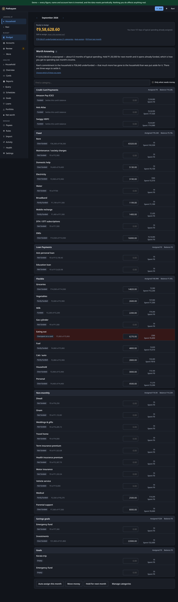

<sub>The purple banner appears only when the development auth-bypass is on; it is absent in production.</sub>

---

## Contents

- [What it is](#what-it-is)
- [Quick start (5 minutes)](#quick-start-5-minutes)
- [Feature tour](#feature-tour)
- [How the core flows work](#how-the-core-flows-work) — diagrams
- [Screens](#screens)
- [Production deployment](#production-deployment) — step by step
- [Configuration reference](#configuration-reference)
- [Backups & recovery](#backups--recovery)
- [Updating](#updating)
- [Architecture](#architecture)
- [What isn't built](#what-isnt-built)

---

## What it is

- **A budget engine, not a tracker.** Money is assigned to categories
  ("envelopes") until nothing is left unassigned. Overspending is handled
  explicitly — you cover it from another envelope, or it reduces next month.
  Both overspend models (YNAB's and Actual's) ship; neither is a stub.
- **Credit cards done right.** Spending on a card creates a payment envelope
  holding the cash to clear it, so a card balance can never be an unfunded
  surprise. Add-on cards (one member's card on another's account) are modelled
  as a first-class mechanic.
- **India-native ingestion.** CSV and password-protected statement PDFs from 11
  banks, UPI narration parsing, five-tier duplicate detection, a review queue,
  a learning rules engine, the CDSL CAS for holdings, and optional read-only
  Gmail fetching of alerts and statements.
- **Loans and investments, contained.** A full amortisation engine (four
  interest models, tranches, pre-EMI, moratorium, prepayment). Unit-based
  holdings with FIFO lots, XIRR, and a net-worth statement — behind a firewall
  (R30) so a portfolio doubling can never touch your budget.
- **Server-only and auditable.** No client storage, no service worker. Every
  mutation is an append-only event, giving universal undo, "explain this
  number", and as-of-date views from one mechanism. Verified backup restore is
  a shipping requirement, not an afterthought.

---

## Quick start (5 minutes)

Everything runs through Docker Compose. **Node is not needed on the host.**

```bash
git clone <this-repo> budget && cd budget
cp .env.example .env

# Seed a demo household (two members, four accounts, a month of real behaviour)
docker compose --profile seed up seed

# Start the dev server with the auth bypass on
docker compose --profile dev up
```

Open <http://localhost:8080> and sign in as **Ravi** or **Priya**. The source is
mounted and Node watches it, so an edit restarts the server without a rebuild.

The seed deliberately includes a cash overspend, a credit overspend and a card
payment, so the screens show real behaviour rather than an empty grid.

> The dev profile sets `DEV_LOGIN`, which **bypasses authentication completely**.
> It exists only in the `dev` Docker stage, is absent from the production image
> (R38.5), and the app refuses to start if it is set alongside anything
> production-shaped — `NODE_ENV=production`, a public hostname, or real Google
> credentials (R38.3). A LAN address still counts as development.

**Run the tests and typecheck:**

```bash
docker compose --profile test up test
```

The engine tests encode the worked ₹ examples from the design docs and assert
the accounting identity after every scenario — if a change breaks that identity,
the change is wrong.

Prefer bare Node? `npm install && npm test`, then `DEV_LOGIN=true npm run dev`.
Compose is the supported path and the only one the production image is built
from.

---

## Feature tour

### The budget engine (`02` R1–R13)

| Feature | What it does |
|---|---|
| **Zero-based assignment** | Assign every rupee to a category until Ready to Assign is 0. |
| **Rollover** | Each month a category carries its leftover (or its overspend) forward. |
| **Two overspend models** | *Reduce next month's RTA* (Actual's, default) or *carry a negative category balance* (YNAB's). Switchable; a full-history recompute follows. |
| **Cover overspend** | One-tap move from another envelope, with ranked source suggestions. |
| **Credit-card payment envelopes** | Card spending reserves the cash to clear it; the envelope tracks the debt, symmetric with a loan's. |
| **Add-on cards** | A member's card on another's account; the transaction owner defaults to the cardholder (R6.e). |
| **Targets & auto-assign** | Per-category targets, and one-tap fund-to-target with a preview before it commits. |
| **Hold for next month / Buffer** | Park income for next month; a one-month buffer is a first-class state. |
| **Forward recompute (R7.g)** | Editing any past month re-derives every month since, under the active overspend model, as one undoable batch. |
| **Explain this number** | Ready to Assign and every category balance drill into the events that produced them. |

### Money in — ingestion (`04`)

| Feature | What it does |
|---|---|
| **Manual entry** | Amount expressions (`450+120`), splits, transfers, tags, owner, cleared flag, memo. |
| **CSV import** | Header detection, Indian amount formats, UPI narration extraction, saved per-bank column mappings. |
| **Statement PDFs** | 11 banks (HDFC, ICICI, Axis, SBI, Union, Canara, YES, IndusInd, Kotak, RBL, HSBC) plus broker contract notes. Password-protected files opened in-process — no external tool, no library. |
| **Password derivation** | Optionally work out the statement password from your saved name / DOB / PAN / mobile / card last-4, so nobody types one. Opt-in, never exported, never logged. |
| **Reconciliation check** | Every parse is verified against the statement's own closing balance. On a real 848-row Axis statement it reconciles to the paisa. |
| **CDSL CAS import** | The monthly consolidated statement is the primary way holdings get in; rows reconcile against existing lots rather than duplicating. |
| **Five dedupe tiers** | Exact, strong (reference), probable, weak, and manual-vs-imported — no receipt appears twice from SMS + email + statement. |
| **Review queue** | Nothing auto-posts; everything imported waits for a human, with raw rows shown throughout. |
| **Learning rules** | Categorise a payee twice → a rule is proposed (never auto-applied); every proposal states the inference it came from. Confirmed rules apply to history with a preview. |
| **Gmail ingestion** | Opt-in, read-only, offline. Reads only the banks' own addresses: an alert becomes a review row within seconds; a statement PDF is fetched, decrypted and parsed on arrival. Add-on alerts route to the right account. |
| **Receipt attachments** | A photo or PDF per transaction, stored server-side in the database, served `no-store` so no device caches it (Q10, R35). |

### Understanding your money

| Feature | What it does |
|---|---|
| **Reports** | Income vs. spending, spending by category over time, loan interest by financial year. |
| **Query** | One filterable, groupable transaction table everything else drills into; CSV export. |
| **Search** | Across cleaned *and* raw imported strings. |
| **Schedules & cashflow calendar** | Recurring transactions (with detection), and a forward balance projection — "will I make it to the 30th?". |
| **Goals** | Long-horizon savings kept off the monthly grid. |
| **Month close** | A once-a-month ritual: what the month did, R29.4's four-way net-worth change, a dated snapshot, and whether next month is funded. Locks nothing. |
| **In-app digest** | Per-member notifications (unfunded card, overspend, month ready to close, cashflow dip) — in-app only, nothing to draw you back. |

### Debt — loans (`06`)

| Feature | What it does |
|---|---|
| **Amortisation engine** | Four interest models: reducing balance, flat (with the equivalent reducing rate shown), moratorium-serviced, moratorium-capitalised. |
| **Tranche drawdown** | Record disbursements as you draw; a builder payment raises the liability without touching your budget, a bank credit arrives to assign (R15). |
| **Pre-EMI / moratorium** | Interest-only obligation on the drawn amount, and both moratorium models with the capitalisation cost quantified before you choose it. |
| **Instalments & drift** | Record each instalment with the lender's split; drift is measured against a lender statement, never against your own ledger. |
| **Prepayment calculator** | Tenure-reduction vs. EMI-reduction, the saving shown side by side before you commit. |
| **Family lending** | Money lent to / borrowed from people, with no interest engine (they don't have one). Balance derived from what moved; write-off available. |

### Assets & net worth (`07`)

| Feature | What it does |
|---|---|
| **Unit holdings** | Stored as units with FIFO lots — enables cost basis, realised/unrealised split, and XIRR as the headline return. |
| **Price feeds** | MFAPI (mutual funds), AMFI (fallback, matched on ISIN), Frankfurter (FX), Alpha Vantage (optional equities). Per-class refresh cadence. |
| **Net worth** | R29.4's four-way decomposition (money saved / market / FX / debt repaid), with a dated history. |
| **Allocation** | By class, geography and currency; an unclassified fund is shown as such, never guessed into a bucket (N9). |
| **CSV export** | Holdings, lots, price history and the net-worth series (F19.13). |
| **The R30 firewall** | Ten invariants as a test suite — including one that drops the price tables and renders the budget screen, proving the budget never reads them. |

### Platform & operations (`08`)

| Feature | What it does |
|---|---|
| **Google SSO** | Closed allow-list, enforced on every request. First sign-in on a fresh instance becomes a member; everyone else is invited. |
| **Sessions & impersonation** | Per-device revocation; read-only "view as" another member, always logged. |
| **Personal API tokens** | Scoped read / read-write, shown once and stored as a hash, rate-limited separately, structurally unable to sign in or mint more tokens. |
| **Feature flags** | Loans, assets and multi-currency each disableable per deployment; a disabled module vanishes from nav, palette and reports (F28). |
| **Backup & verified restore** | The scheduled job restores the latest backup into a scratch DB and matches control totals; failure fires a webhook, success pings a dead-man's-switch. |
| **Health page** | The page you open at 2am — backup status, price-feed health, flags, error counts. |
| **Command palette** | `Cmd/Ctrl-K` from anywhere; complete and flag-aware. |
| **Universal undo** | Every action undoes within 30 days, from the event log. |

---

## How the core flows work

GitHub renders these diagrams inline.

### Architecture — server-only by policy (R35)

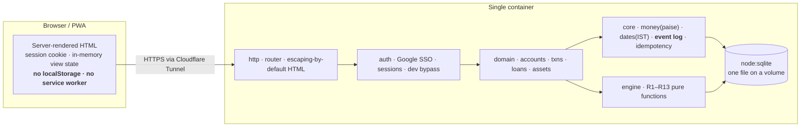
```mermaid
flowchart LR
  subgraph Client["Browser / PWA"]
    UI["Server-rendered HTML<br/>session cookie · in-memory view state<br/><b>no localStorage · no service worker</b>"]
  end
  subgraph Server["Single container"]
    HTTP["http · router · escaping-by-default HTML"]
    AUTH["auth · Google SSO · sessions · dev bypass"]
    ENGINE["engine · R1–R13 pure functions"]
    DOMAIN["domain · accounts · txns · loans · assets"]
    CORE["core · money(paise) · dates(IST) · <b>event log</b> · idempotency"]
    DB[("node:sqlite<br/>one file on a volume")]
  end
  UI -->|"HTTPS via Cloudflare Tunnel"| HTTP
  HTTP --> AUTH --> DOMAIN
  DOMAIN --> ENGINE
  DOMAIN --> CORE --> DB
  ENGINE --> DB
```

### The envelope engine identity (`docs/dev/01-engine-derivation.md`)

Every computed month must satisfy one equation, asserted in tests after every
scenario:

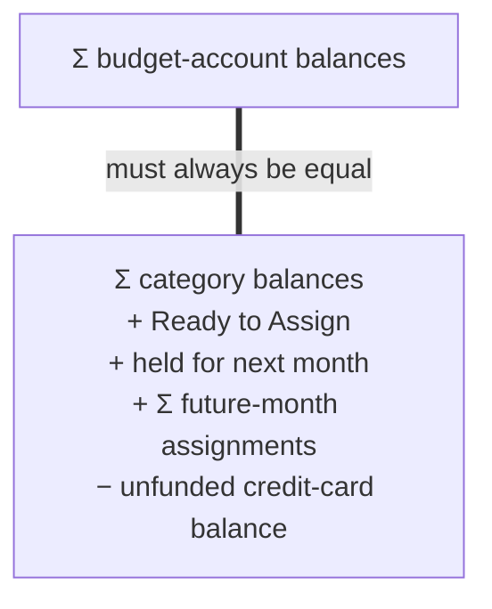
```mermaid
flowchart TB
  A["Σ budget-account balances"]
  B["Σ category balances<br/>+ Ready to Assign<br/>+ held for next month<br/>+ Σ future-month assignments<br/>− unfunded credit-card balance"]
  A ===|"must always be equal"| B
```

### Import → review → ledger (`04` §1)

Every source — CSV, PDF, CAS, Gmail alert — produces the **same raw record** and
lands in the **same review queue**. Nothing auto-posts.

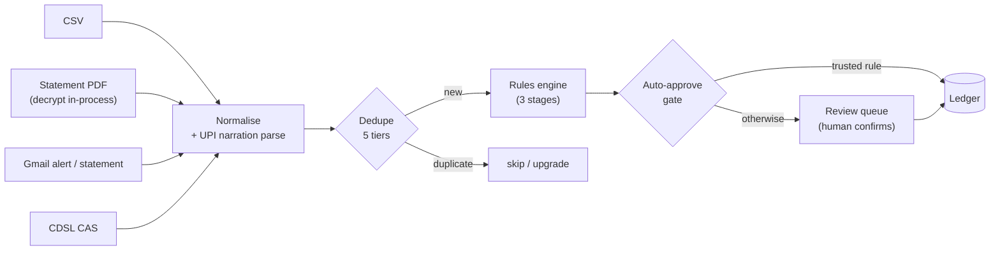
```mermaid
flowchart LR
  CSV["CSV"] --> N
  PDF["Statement PDF<br/>(decrypt in-process)"] --> N
  GMAIL["Gmail alert / statement"] --> N
  CAS["CDSL CAS"] --> N
  N["Normalise<br/>+ UPI narration parse"] --> D{"Dedupe<br/>5 tiers"}
  D -->|"new"| R["Rules engine<br/>(3 stages)"]
  D -->|"duplicate"| SKIP["skip / upgrade"]
  R --> G{"Auto-approve<br/>gate"}
  G -->|"trusted rule"| LEDGER[("Ledger")]
  G -->|"otherwise"| REVIEW["Review queue<br/>(human confirms)"]
  REVIEW --> LEDGER
```

### The credit-card payment envelope (`02` R6)

Why a card balance is never an unfunded surprise:

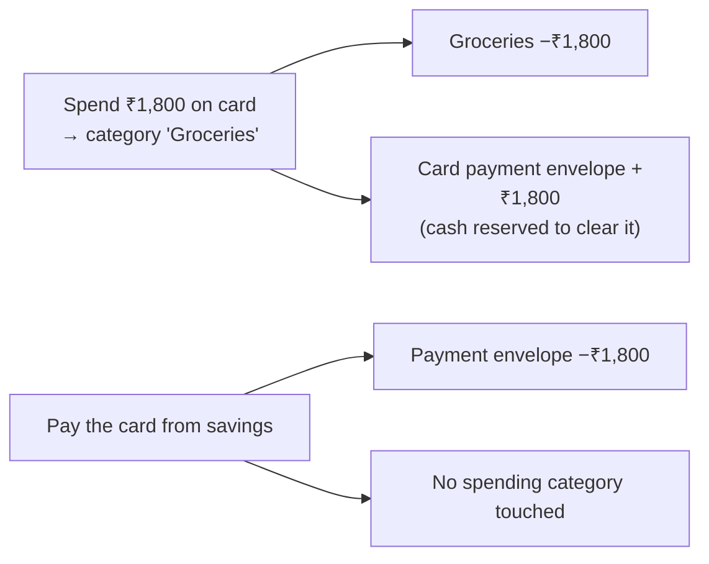
```mermaid
flowchart LR
  SPEND["Spend ₹1,800 on card<br/>→ category 'Groceries'"] --> R1["Groceries −₹1,800"]
  SPEND --> R2["Card payment envelope +₹1,800<br/>(cash reserved to clear it)"]
  PAY["Pay the card from savings"] --> R3["Payment envelope −₹1,800"]
  PAY --> R4["No spending category touched"]
```

### Gmail ingestion — a separate, opt-in grant (`04` §3.4)

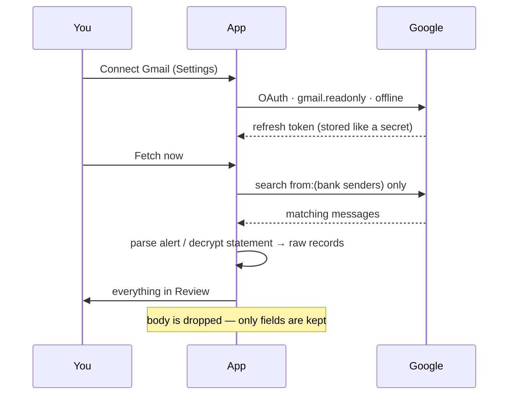
```mermaid
sequenceDiagram
  participant U as You
  participant App
  participant Google
  U->>App: Connect Gmail (Settings)
  App->>Google: OAuth · gmail.readonly · offline
  Google-->>App: refresh token (stored like a secret)
  U->>App: Fetch now
  App->>Google: search from:(bank senders) only
  Google-->>App: matching messages
  App->>App: parse alert / decrypt statement → raw records
  App->>U: everything in Review
  note over App: body is dropped — only fields are kept
```

### Backup → verified restore (R40.2) — a shipping requirement

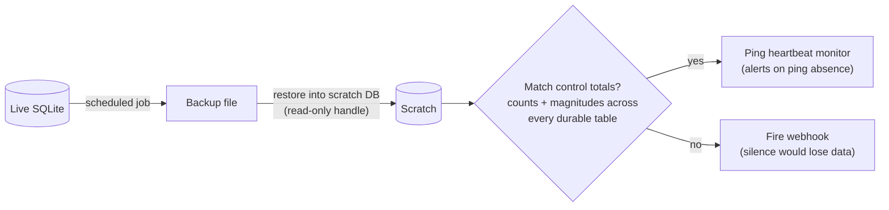
```mermaid
flowchart LR
  LIVE[("Live SQLite")] -->|"scheduled job"| BK["Backup file"]
  BK -->|"restore into scratch DB<br/>(read-only handle)"| SCRATCH[("Scratch")]
  SCRATCH --> CMP{"Match control totals?<br/>counts + magnitudes across<br/>every durable table"}
  CMP -->|"yes"| HB["Ping heartbeat monitor<br/>(alerts on ping absence)"]
  CMP -->|"no"| WH["Fire webhook<br/>(silence would lose data)"]
```

### Loan lifecycle (`06` R15/R16)

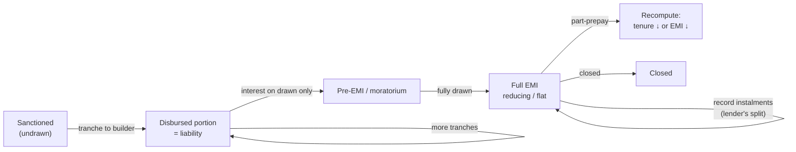
```mermaid
flowchart LR
  S["Sanctioned<br/>(undrawn)"] -->|"tranche to builder"| T["Disbursed portion<br/>= liability"]
  T -->|"more tranches"| T
  T -->|"interest on drawn only"| PE["Pre-EMI / moratorium"]
  PE -->|"fully drawn"| EMI["Full EMI<br/>reducing / flat"]
  EMI -->|"record instalments<br/>(lender's split)"| EMI
  EMI -->|"part-prepay"| PP["Recompute:<br/>tenure ↓ or EMI ↓"]
  EMI -->|"closed"| C["Closed"]
```

---

## Screens

The app is server-rendered HTML — every screen is a plain URL you can open. This
table is the map; run the [quick start](#quick-start-5-minutes) to see them live
with the demo data.

| Screen | Route | What you see |
|---|---|---|
| **Budget** | `/` | The month grid: groups, categories, assigned/activity/available, Ready to Assign, the in-app digest. |
| **Accounts** | `/accounts` | Every account with cleared/uncleared/working balances; each opens a register. |
| **Register** | `/accounts/:id` | A running-balance transaction list for one account, with reconcile. |
| **Transaction** | `/transaction/:id` | Edit, splits, tags, owner; raw imported values; full event history; **receipts**. |
| **Review** | `/review` | Everything imported awaiting confirmation: imports, suspected duplicates, uncategorised, overspent, unfunded cards, proposed rules. |
| **Import** | `/import` | CSV paste / statement-PDF upload with password hints; saved mappings. |
| **Reports** | `/reports` | Income vs. spend, category trends, loan interest by FY. |
| **Query** | `/query` | The filterable, groupable table; CSV export. |
| **Schedules** | `/schedules` | Recurring items and the forward cashflow calendar. |
| **Goals** | `/goals` | Long-horizon savings with progress rings. |
| **Loans** | `/loans`, `/loans/:id` | Each loan's real cost, schedule, drift, prepayment calculator, disbursements. |
| **Family lending** | `/family` | Lent / borrowed, derived balances, write-off. |
| **Portfolio** | `/portfolio` | Holdings as units, XIRR, allocation, CAS import, CSV export. |
| **Net worth** | `/net-worth` | The four-way decomposition and dated history. |
| **Month close** | `/months` | The monthly ritual and closed-month history. |
| **Settings** | `/settings` | Household, theme, devices, Gmail connection, statement identity, notification prefs, API tokens. |
| **Health** | `/health` | Backup status, restore verification, price feeds, feature flags, error counts. |

### A look at the screens

Captured from a running instance with the demo household. The UI is theme-aware
(light / dark / system); these are the dark theme.

| Portfolio | Net worth |
|---|---|
| [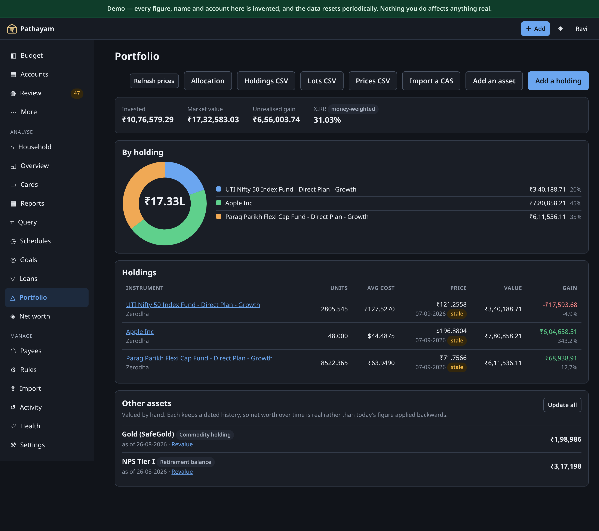](docs/screenshots/portfolio.png) | [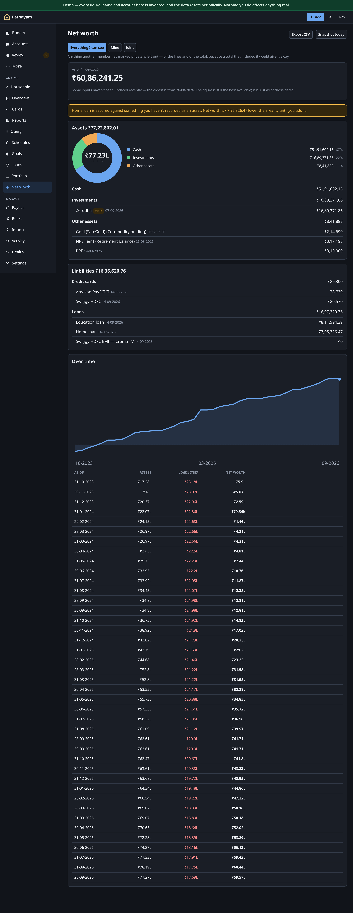](docs/screenshots/net-worth.png) |
| **Allocation** | **Loans** |
| [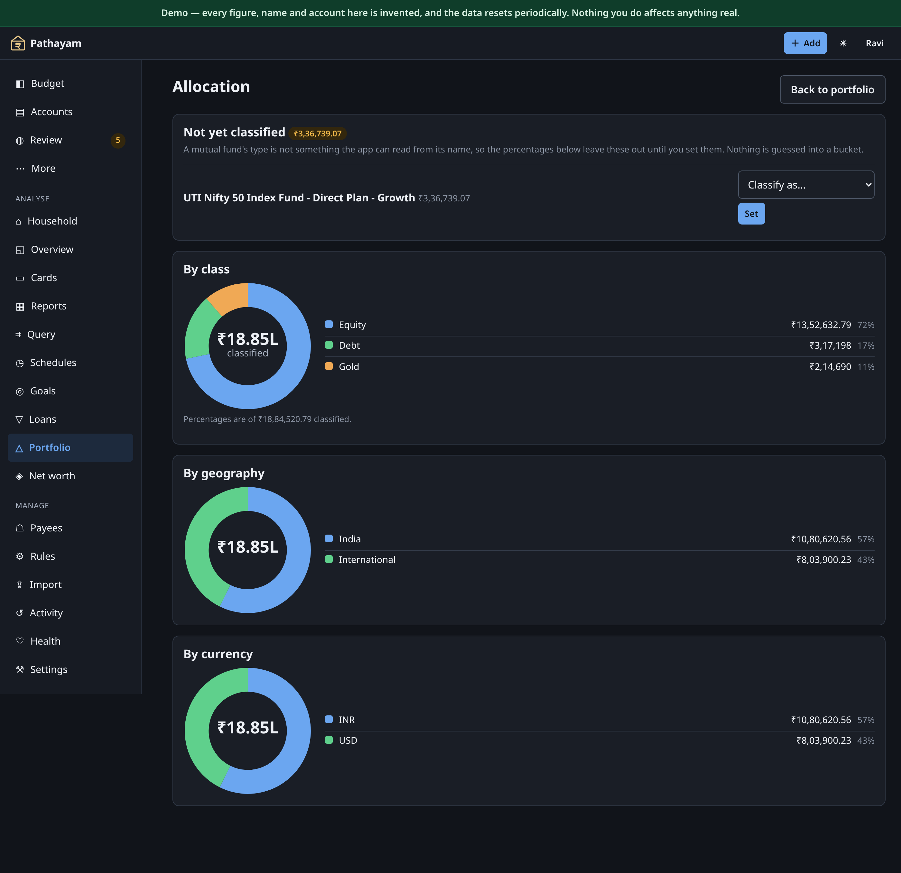](docs/screenshots/allocation.png) | [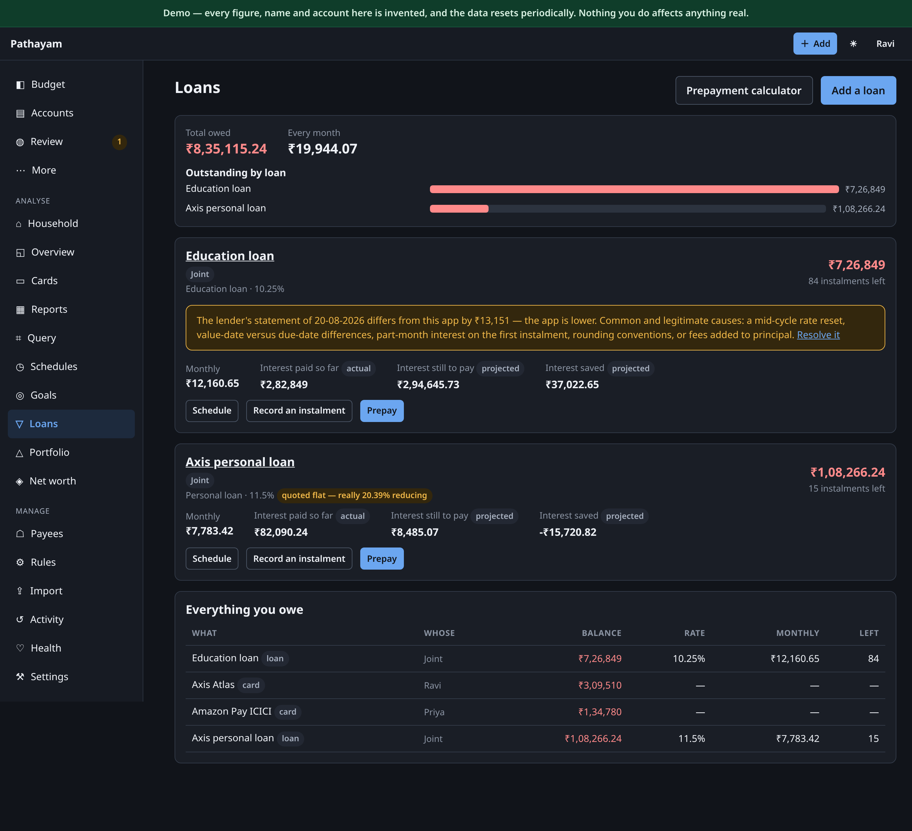](docs/screenshots/loans.png) |
| **Accounts** | **Review queue** |
| [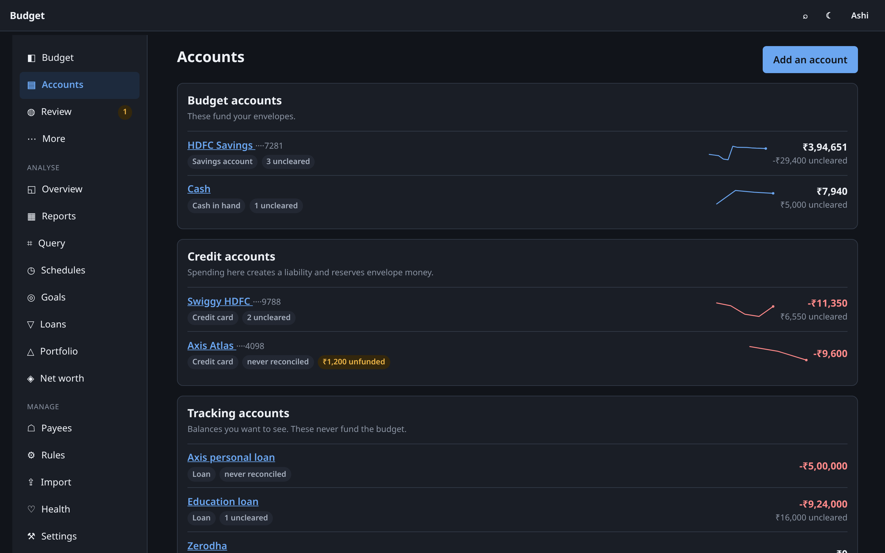](docs/screenshots/accounts.png) | [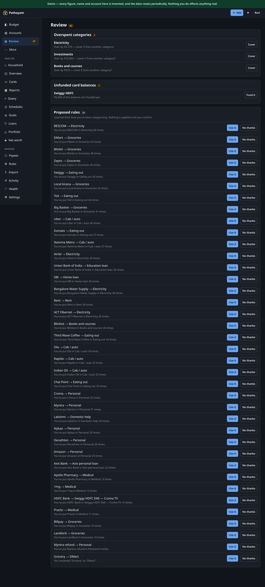](docs/screenshots/review.png) |
| **Import** | **Schedules** |
| [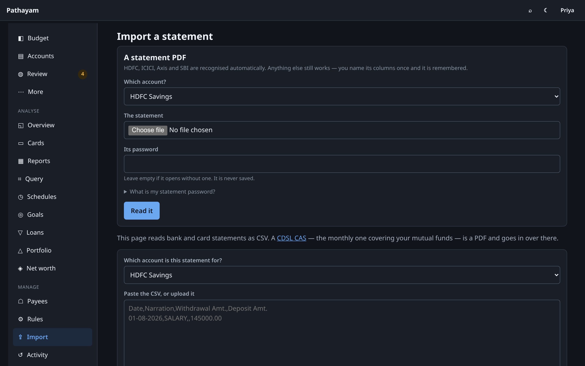](docs/screenshots/import.png) | [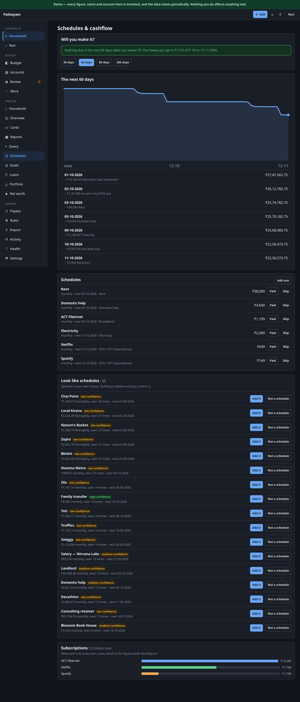](docs/screenshots/schedules.png) |
| **Goals** | **Reports** |
| [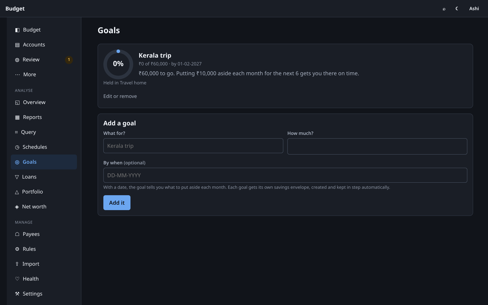](docs/screenshots/goals.png) | [](docs/screenshots/reports.png) |
| **Health** | **Settings** |
| [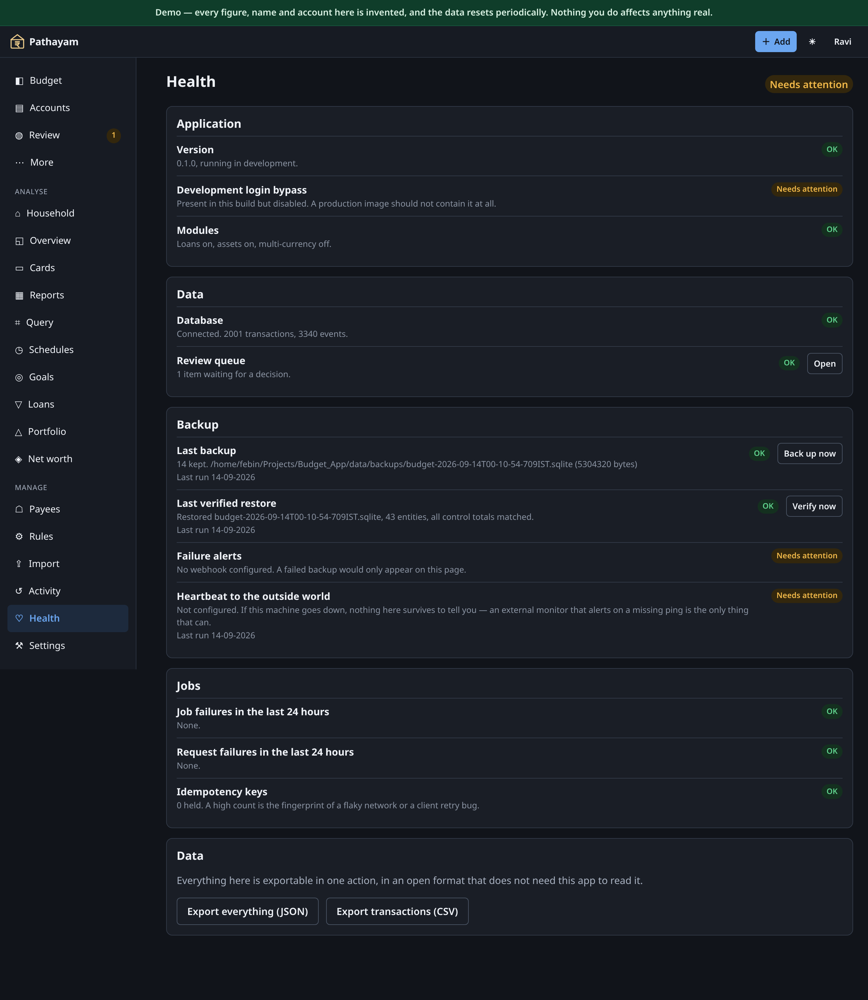](docs/screenshots/health.png) | [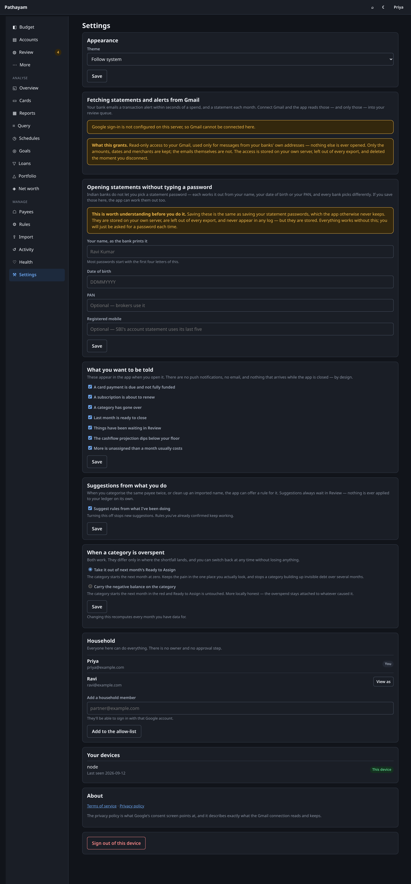](docs/screenshots/settings.png) |

Click any image for the full-resolution capture.

---

## Production deployment

The target is a **homelab box behind a Cloudflare Tunnel** (Q8): the container
binds to loopback, the tunnel provides TLS and the public hostname, and nothing
is exposed on the LAN. Any reverse proxy that terminates TLS works the same way.

### 1. Prerequisites

- A machine with Docker + Docker Compose.
- A domain you control, e.g. `budget.example.com`.
- A Cloudflare account (free) for the tunnel — or any TLS-terminating proxy.
- A Google Cloud project for SSO (below).

### 2. Google OAuth setup

1. In the [Google Cloud console](https://console.cloud.google.com/): create a
   project, then **APIs & Services → Credentials → Create Credentials → OAuth
   client ID → Web application**.
2. Under **Authorised redirect URIs**, add **both**:
   - `https://budget.example.com/auth/google/callback` (sign-in)
   - `https://budget.example.com/gmail/callback` (only if you'll use Gmail fetch)
3. Copy the **Client ID** and **Client secret** into `.env`.
4. For Gmail fetch, also: **APIs & Services → Enable APIs → Gmail API**, and add
   the `.../auth/gmail.readonly` scope on the consent screen. If the app is in
   "testing", add each household member as a test user.

### 3. Configure

```bash
cp .env.example .env
```

Set at least:

```dotenv
BASE_URL=https://budget.example.com        # exact public origin
GOOGLE_CLIENT_ID=...
GOOGLE_CLIENT_SECRET=...
HEARTBEAT_URL=https://hc-ping.com/<uuid>    # strongly recommended (see Backups)
BACKUP_WEBHOOK_URL=https://...              # where failures alert
```

Compose **refuses to start** without `BASE_URL` and the two Google values,
rather than booting something half-configured.

### 4. Start it

```bash
docker compose up -d
docker compose logs -f budget     # structured logs
docker compose ps                 # health status
```

It serves on `127.0.0.1:8080` by default — reachable by the tunnel, not the LAN.

### 5. Point the tunnel at it

With `cloudflared`:

```bash
cloudflared tunnel create budget
cloudflared tunnel route dns budget budget.example.com
# ingress rule → service: http://127.0.0.1:8080
cloudflared tunnel run budget
```

(Or run `cloudflared` as its own container/service. Any proxy that forwards
`https://budget.example.com` → `http://127.0.0.1:8080` and sets
`X-Forwarded-For` works; `TRUST_PROXY=true` is already set in the compose file.)

### 6. First sign-in

Open `https://budget.example.com`. **The first person to sign in becomes a
member** (F1.3) and adds the rest from Settings. Everyone else must be
invited first — there is no self-service signup, and all members are peers
(no owner, no viewer). Then run the first-run wizard to pick a starting
template.

---

## Configuration reference

| Variable | Required | Default | Notes |
|---|---|---|---|
| `BASE_URL` | **yes** | — | The public origin, exactly. OAuth redirects and cookie scoping depend on it. |
| `GOOGLE_CLIENT_ID` | **yes** | — | Google Cloud OAuth 2.0 Web client. |
| `GOOGLE_CLIENT_SECRET` | **yes** | — | |
| `PORT` | no | `8080` | Host port for the production service (bound to loopback). |
| `DEV_PORT` | no | `8080` | Host port for the dev profile. |
| `SESSION_DAYS` | no | `30` | Session idle timeout (Q22). |
| `LOG_LEVEL` | no | `info` | `debug` / `info` / `warn` / `error`. No financial values are ever logged. |
| `HEARTBEAT_URL` | **recommended** | — | Pinged on a *successful* verified restore. The only thing that can tell you the box is down (R40.8). |
| `BACKUP_WEBHOOK_URL` | recommended | — | Where a failed backup or restore verification alerts (R40.4). |
| `ALPHA_VANTAGE_KEY` | no | — | Only for direct equities; leave empty (mutual funds use keyless MFAPI). |
| `FEATURE_LOANS` | no | `true` | Disable the loans module (F28). |
| `FEATURE_ASSETS` | no | `true` | Disable the assets / net-worth module. |
| `FEATURE_MULTI_CURRENCY` | no | `false` | Off by default (Q18: ₹-only accounts). |
| `TRUST_PROXY` | no | `true` in compose | Read the client IP from `X-Forwarded-For`. |
| `DATA_DIR` | no | `/data` | Where the SQLite file and backups live. |
| `DEV_LOGIN` | **never in prod** | — | Auth bypass. Absent from the production image (R38.5); the app refuses to start with it in a production-shaped environment (R38.3). |

Disabled feature modules **keep their data** — re-enabling restores the module
intact (F28.3).

---

## Backups & recovery

The whole dataset is **one SQLite file** in the data volume, in an open format
the `sqlite3` CLI reads without this application (R40.7). Copy it out any time:

```bash
docker compose cp budget:/data/budget.sqlite ./budget-backup.sqlite
```

**Taking a backup is not the same as being able to recover.** So the scheduled
job is a restore *verification* (R40.2): it restores the most recent backup into
a scratch database (opened read-only, so it cannot touch the live one) and
compares record counts *and* magnitude totals across **every durable table** —
budget, loans, holdings, lots, net-worth history, receipts. A restore that
silently dropped the entire portfolio would fail here.

- The result shows on the **health page**: *"N entities, all control totals
  matched."*
- A **failure fires `BACKUP_WEBHOOK_URL`** — that is the one failure class where
  silence loses data.
- A **success pings `HEARTBEAT_URL`**. This matters most: the webhook fires
  *from* the deployment, so if the box is down, the tunnel dropped, or the job
  never ran, nothing is left to send it. `HEARTBEAT_URL` points at a
  dead-man's-switch service (e.g. healthchecks.io) that alerts on the ping's
  *absence*. **Set it.** Use an expected interval of the verification schedule
  plus slack, so one slow run doesn't page anyone at 2am.

Both backup and verification can also be run by hand from the health page.

**Secrets never leave the box.** Statement passwords (PAN/DOB/mobile) and the
Gmail refresh token are excluded from every export and never logged — asserted
by tests.

---

## Updating

```bash
git pull
docker compose build budget
docker compose up -d budget
```

Schema migrations run automatically at startup, in order, inside transactions —
each is append-only and applied once. There is no manual migration step. Take a
backup first out of habit; the verified-restore job is your proof it worked.

---

## Architecture

**Zero runtime dependencies.** Node's standard library covers everything —
`node:sqlite`, `node:http`, `node:test`, `node:crypto`, `node:zlib` — which
keeps the Content-Security-Policy honest and the attack surface small. Even the
PDF reader and the RC4/AES statement decryption are written in-repo rather than
pulled from npm.

```
src/
  core/       money (integer paise), dates (IST civil dates),
              the event log (R37), idempotency (R36)
  db/         schema, 15 migrations, typed query helpers
  engine/     R1–R13 as pure functions, plus the SQL that feeds them
  domain/     mutations — accounts, categories, transactions, loans, assets,
              family loans, month-close, attachments
  loans/      the amortisation engine (pure)
  portfolio/  holdings, FIFO, XIRR, price providers (pure + adapters)
  import/     CSV, PDF statements, CAS, email alerts, dedupe, rules, identity
  pdf/        an in-repo PDF reader + RC4/AES decryptor
  gmail/      OAuth grant, API client, fetch orchestration
  auth/       Google SSO, sessions, impersonation, API tokens, the dev bypass
  ops/        backup, verified restore, health
  http/       server, router, escaping-by-default HTML, multipart
  web/        page shell, theme, client script, screens
```

Three constraints shaped most of it:

**The server is the only place data lives** (R35). No `localStorage`, no
`IndexedDB`, no service worker, no read cache. The client is a manifest, static
assets, a session cookie and in-memory view state. This is also why rendering is
server-side: the resolved theme must be in the first response so the wrong theme
never paints (R39.3).

**Every mutation is an event, and every write carries an idempotency key** (R36,
R37) — both built before any feature used them, because retrofitting either
means rewriting every mutation path. The log pays for undo, "explain this
number", and as-of-date views with one mechanism instead of three.

**The engine is pure and tested against worked examples.** The worst risk in the
project is engine semantics going subtly wrong and surfacing in month four,
costing a rewrite of every stored figure. The mitigation is a test suite written
before any UI, and the accounting identity asserted after every scenario. The
same pattern repeats for loans and the portfolio: pure maths, no database,
pinned against the docs' worked figures before any screen exists.

The build decisions — including the bugs that shaped the code and the deliberate
departures — are logged in
[`docs/11-build-decisions.md`](docs/11-build-decisions.md).

---

## What isn't built

| Gap | Why |
|---|---|
| **SMS forwarding** (`04` §3.5) | Needs an Android companion to forward SMS bodies; the parser would reuse the alert mechanism. iOS cannot read SMS — a platform limit, not a gap. |

Everything else in the design set is built. The three things `05` §3 says can
never be retrofitted — the engine's semantics, idempotency keys, and the event
log — are all in place, and every source of transactions terminates in the same
review queue, which is what makes remaining ingestion work additive.

**A known wart, recorded rather than hidden:** viewing a *past* month subtracts
assignments made in the months since, so a July view in December can read lower
than July ever did. That follows `02` R2 literally; the reasoning and its
containment are in
[`docs/dev/01-engine-derivation.md`](docs/dev/01-engine-derivation.md) §4.

---

## The design docs

The [`docs/`](docs/00-README.md) set is the specification, not an afterthought —
start with [`00-README.md`](docs/00-README.md) for the map, or
[`09-decisions-log.md`](docs/09-decisions-log.md) for what was actually decided.
[`10-errata-and-addenda.md`](docs/10-errata-and-addenda.md) carries the
corrections adopted during the build, and
[`11-build-decisions.md`](docs/11-build-decisions.md) records why the code is
shaped the way it is. For scripting the app over its personal API tokens, see
the [**API reference**](docs/API.md).
